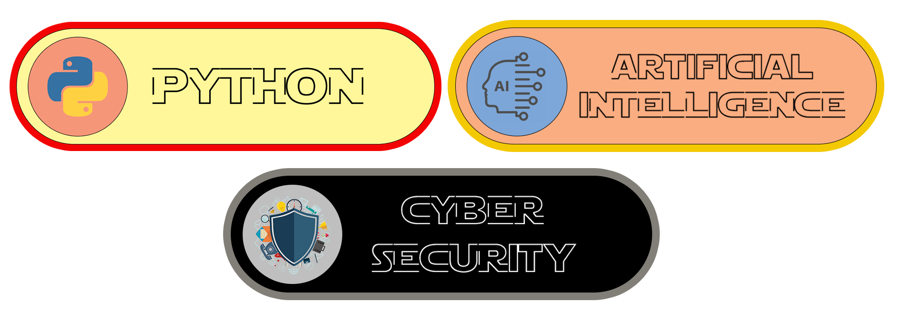

<div align="center">
    
</div>


  
<div align="center">
    
</div>

## 📊 GitHub Stats


<div align="center">

</div>

## 🛠️⚙️ Interests ⚙️🛠️

<div align="center">
    
</div>


</div>

## 🎯 Primary Objectives  

- Initialize Python modules  
- Deploy code packages  
- Implement strategic development patterns  
- Maintain a reliable codebase 

## 🖥️


## ⚡ Analytics

<div align="center">
<a href="https://github.com/anuraghazra/github-readme-stats"></a> | <a href="https://github.com/anuraghazra/github-readme-stats"></a> |

</div>


</div>

## 📡 Secure Communications

<div align="center">

<a href="mailto:sachinbp359@gmail.com">
  
</a>
</div>


<div align="center">

### ⚔️ COUNT ⚔️


</div>

---
<div align="center">

```ascii

 ░▒▓███████▓▒░▒▓███████▓▒░░▒▓███████▓▒░▒▓███████▓▒░░▒▓████████▓▒░▒▓██████▓▒░  
░▒▓█▓▒░      ░▒▓█▓▒░░▒▓█▓▒░▒▓█▓▒░░▒▓█▓▒░     ░▒▓█▓▒░▒▓█▓▒░     ░▒▓█▓▒░░▒▓█▓▒░ 
░▒▓█▓▒░      ░▒▓█▓▒░░▒▓█▓▒░▒▓█▓▒░░▒▓█▓▒░     ░▒▓█▓▒░▒▓█▓▒░     ░▒▓█▓▒░░▒▓█▓▒░ 
 ░▒▓██████▓▒░░▒▓███████▓▒░░▒▓███████▓▒░▒▓███████▓▒░░▒▓███████▓▒░░▒▓███████▓▒░ 
       ░▒▓█▓▒░▒▓█▓▒░░▒▓█▓▒░▒▓█▓▒░            ░▒▓█▓▒░      ░▒▓█▓▒░     ░▒▓█▓▒░ 
       ░▒▓█▓▒░▒▓█▓▒░░▒▓█▓▒░▒▓█▓▒░            ░▒▓█▓▒░      ░▒▓█▓▒░     ░▒▓█▓▒░ 
░▒▓███████▓▒░░▒▓███████▓▒░░▒▓█▓▒░     ░▒▓███████▓▒░░▒▓███████▓▒░░▒▓██████▓▒░  
                                                                              
                                                                              
```

</div>
